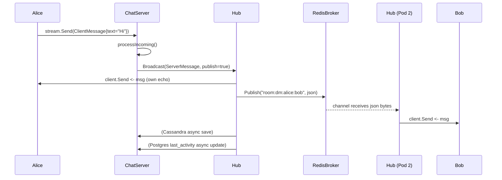
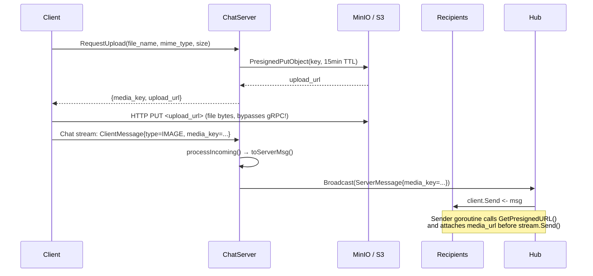
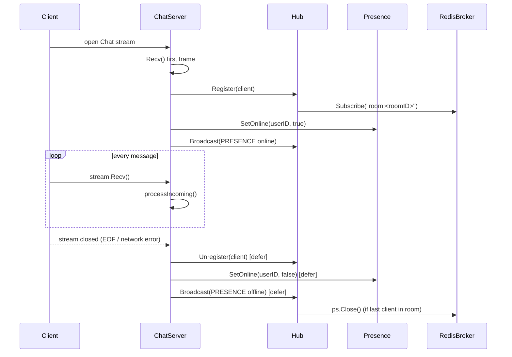
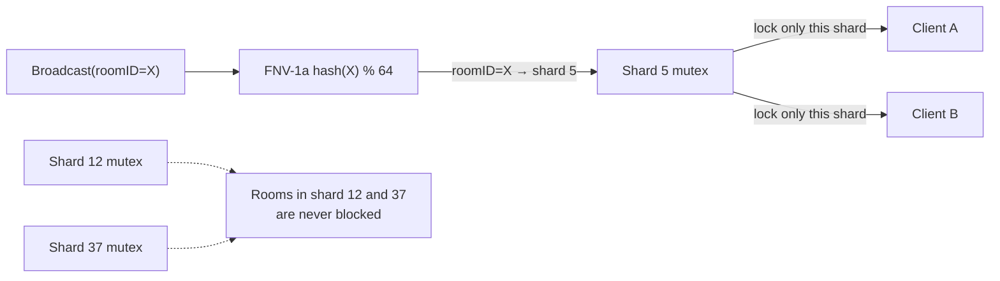
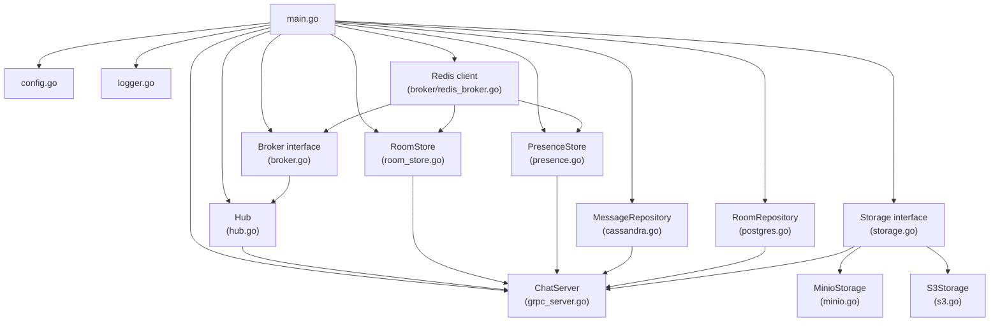

# chat-service — Deep Dive

A production-ready **gRPC bidirectional-streaming chat service** in Go.  
Supports 1-to-1 DMs, group chats, file/image/video sharing, typing indicators, read receipts, reactions, presence, and message history.

---

## Table of contents

1. [How the whole system works](#1-how-the-whole-system-works)
2. [Why Redis — not Kafka](#2-why-redis--not-kafka)
3. [gRPC APIs explained](#3-grpc-apis-explained)
4. [Why MinIO — and how to switch to AWS S3](#4-why-minio--and-how-to-switch-to-aws-s3)
5. [Every file explained line-by-line](#5-every-file-explained-line-by-line)
6. [Flow diagrams — who calls what and why](#6-flow-diagrams--who-calls-what-and-why)
7. [Unused code removed](#7-unused-code-removed)
8. [Running locally](#8-running-locally)
9. [Running tests](#9-running-tests)

---

## 1. How the whole system works

```
┌─────────────┐   gRPC bidi stream   ┌──────────────────────────────────────┐
│  Client A   │◄────────────────────►│                                      │
│  (Alice)    │                      │          ChatServer (gRPC)           │
└─────────────┘                      │  grpc_server.go                      │
                                     │                                      │
┌─────────────┐   gRPC bidi stream   │  • validates first message           │
│  Client B   │◄────────────────────►│  • calls hub.Register(client)        │
│  (Bob)      │                      │  • starts sender goroutine           │
└─────────────┘                      │  • receive loop → processIncoming()  │
                                     └──────────┬───────────────────────────┘
                                                │ hub.Broadcast()
                                     ┌──────────▼───────────────────────────┐
                                     │           Hub  (hub.go)              │
                                     │  64 sharded maps: roomID → clients   │
                                     │  • writes to every client.Send chan  │
                                     │  • publishes to Redis (cross-pod)    │
                                     └──────────┬───────────────────────────┘
                                                │ Broker.Publish / Subscribe
                                     ┌──────────▼───────────────────────────┐
                                     │        Redis Pub/Sub                 │
                                     │  channel: "room:<roomID>"            │
                                     │  any pod subscribed gets the bytes   │
                                     └──────────────────────────────────────┘

  Separate data stores (all optional, service degrades gracefully):

  ┌─────────────────────┐   ┌──────────────────────┐   ┌──────────────────┐
  │  Cassandra           │   │  PostgreSQL           │   │  MinIO / S3      │
  │  Message history    │   │  Rooms & members      │   │  Files & images  │
  │  (write-optimised)  │   │  (relational, ACID)   │   │  (object store)  │
  └─────────────────────┘   └──────────────────────┘   └──────────────────┘
```

### Step-by-step message journey

1. **Alice opens a Chat stream** → sends first gRPC frame with `user_id="alice"`, `room_id="dm:alice:bob"`.
2. **Server registers Alice** → `hub.Register(ctx, client)` puts her into the room's shard.  
   Sets her online in Redis (`chat:presence:alice = 1` with 60s TTL).  
   Broadcasts a `PRESENCE` event to the room so Bob's UI shows Alice as online.
3. **Alice sends "Hello Bob!"** → frame arrives in `stream.Recv()`.  
   `processIncoming()` sees `EVENT_TYPE_MESSAGE`, calls `hub.Broadcast()`.
4. **Hub broadcasts** → iterates all clients in the shard for `room_id`, drops `ServerMessage` into each `client.Send` channel.  
   Also calls `broker.Publish()` which writes the JSON to Redis channel `room:dm:alice:bob`.
5. **Sender goroutine** (one per connected client) drains `client.Send` → calls `stream.Send(m)` to push to the gRPC stream.  
   For media messages it also attaches a fresh presigned download URL before sending.
6. **Other pods** subscribed to `room:dm:alice:bob` via Redis receive the published bytes → unmarshal → call their local `hub.Broadcast(publish=false)` → their own connected clients receive the message.
7. **Cassandra persistence** → `persistMessage()` runs in a goroutine, saves the message to the `messages_by_room` table bucketed by day.
8. **PostgreSQL** → `UpdateLastActivity()` updates the `chat_room_last_activity` table with the latest message preview and timestamp.

---

## 2. Why Redis — not Kafka

**Kafka is not used in this service.** Here is the honest explanation of why, and when you would add it.

### What we needed

| Requirement | Redis Pub/Sub | Kafka |
|---|---|---|
| Real-time fan-out (< 5 ms) | ✅ Yes | ⚠️ Higher latency (batching) |
| Already in the stack (room store, presence) | ✅ Same client | ❌ Extra cluster |
| Fire-and-forget (no replay needed for live delivery) | ✅ Perfect fit | ✅ Over-engineered |
| Simple operational model | ✅ Single process | ❌ Zookeeper / KRaft, brokers, topics |
| At-most-once is acceptable for live delivery | ✅ Redis drops if no subscriber | ✅ Configurable |

**Conclusion for this service:** Redis Pub/Sub is the right tool.  
A message that is missed because no pod was subscribed is simply not delivered live — the client fetches it via `GetMessages` (Cassandra) on next open. That is the standard approach (WhatsApp, Slack, iMessage all do this).

### When you would add Kafka

- **Analytics pipeline** — stream every message event to a data warehouse (BigQuery, Redshift) without touching the gRPC path.
- **Notification service** — a separate `notification-service` consumes from Kafka to send push notifications (FCM, APNs) without coupling to chat-service.
- **Audit log** — compliance requires a tamper-proof ordered log of all messages.
- **Fan-out to many microservices** — moderation, spam detection, translation.

In that scenario the architecture would be:

```
hub.Broadcast()
    │
    ├─► Redis Pub/Sub   (live delivery to connected clients, same pod)
    │
    └─► Kafka Producer  (async, durable log for downstream consumers)
              │
              ├─► notification-service  (push notifications)
              ├─► analytics-service     (data warehouse)
              └─► moderation-service    (spam/NSFW detection)
```

---

## 3. gRPC APIs explained

The full contract lives in [`proto/chat.proto`](proto/chat.proto).

### 3.1 `Chat` — bidirectional streaming

```
rpc Chat(stream ClientMessage) returns (stream ServerMessage)
```

**Why bidirectional streaming?**  
A normal unary RPC is request → response and closes. Chat needs a persistent open connection where both sides can send at any time. HTTP/2 streams (which gRPC uses) are perfect for this — they are full-duplex and use a single TCP connection.

**ClientMessage fields:**

| Field | Type | Purpose |
|---|---|---|
| `room_id` | string | Which room (required on every frame) |
| `user_id` | string | Who is sending |
| `message_id` | string | Client-generated UUID (for dedup / receipts) |
| `text` | string | Text content (empty for media-only) |
| `sent_at_unix_ms` | int64 | Client timestamp (used as Cassandra clustering key) |
| `type` | MessageType | TEXT / IMAGE / VIDEO / AUDIO / FILE |
| `media_key` | string | Object key returned by `RequestUpload` |
| `media_name` | string | Original filename |
| `event_type` | EventType | MESSAGE / TYPING_START / TYPING_STOP / READ_RECEIPT / REACTION / DELETE / PRESENCE |
| `reply_to_message_id` | string | Threaded replies |
| `reaction_emoji` | string | Emoji for REACTION events |

**EventType routing in `processIncoming()`:**

```
EVENT_TYPE_MESSAGE      → hub.Broadcast() + Cassandra save + Postgres update
EVENT_TYPE_TYPING_START → hub.Broadcast(publish=false) — never stored
EVENT_TYPE_TYPING_STOP  → hub.Broadcast(publish=false) — never stored
EVENT_TYPE_READ_RECEIPT → Cassandra + Postgres update + hub.Broadcast(publish=false)
EVENT_TYPE_REACTION     → hub.Broadcast(publish=true)
EVENT_TYPE_DELETE       → Cassandra soft-delete + hub.Broadcast(publish=true)
EVENT_TYPE_PRESENCE     → automatically sent on connect/disconnect (not client-triggered)
```

---

### 3.2 `CreateRoom` — unary

```
rpc CreateRoom(CreateRoomRequest) returns (CreateRoomResponse)
```

**DM rooms** are idempotent. The `room_id` is computed as `dm:<lower_id>:<higher_id>` — deterministic regardless of who calls it first or the order of member IDs. Calling `CreateRoom(alice, bob)` and `CreateRoom(bob, alice)` always returns the same room.

**Group rooms** get a UUID-based `room_id = "group:<uuid>"`. Every call creates a new group.

**Storage backends:**
- If PostgreSQL is configured → `RoomRepository.GetOrCreateDM()` / `CreateGroup()` (ACID transactions, FK constraints).
- Otherwise → `RoomStore` (Redis-backed or in-memory fallback).

---

### 3.3 `RequestUpload` — unary

```
rpc RequestUpload(UploadRequest) returns (UploadResponse)
```

**Why not upload via gRPC?**  
gRPC is optimised for small structured messages, not large binary blobs. Sending a 10 MB video through gRPC would:
- Consume the gRPC stream for seconds.
- Route all bytes through the Go process (wasting CPU and memory).
- Block other messages from that client.

Instead the server generates a **presigned HTTP PUT URL** pointing directly at MinIO/S3. The client uploads to that URL with a plain HTTP PUT — the bytes never touch the Go server.

**Object key format:** `rooms/<room_id>/<user_id>/<timestamp_ms>/<filename>` (colons replaced with underscores for S3 compatibility).

**100 MB hard cap** is enforced at the RPC level before issuing the URL.

---

### 3.4 `GetDownloadUrl` — unary

```
rpc GetDownloadUrl(GetDownloadUrlRequest) returns (GetDownloadUrlResponse)
```

Returns a fresh presigned HTTP GET URL (valid 15 minutes) for any `media_key`. Clients call this when they need to render a media message and the URL embedded in the `ServerMessage` has expired.

---

### 3.5 `GetMessages` — unary

```
rpc GetMessages(GetMessagesRequest) returns (GetMessagesResponse)
```

Fetches message history from Cassandra with cursor-based pagination (`before_unix_ms`). Also auto-marks the conversation as read for the requesting user.

Returns `has_more=true` when there are older messages to page through.

---

### 3.6 `GetPresence` — unary

```
rpc GetPresence(GetPresenceRequest) returns (GetPresenceResponse)
```

Batch lookup of online/last-seen status for a list of user IDs.  
Backed by Redis keys `chat:presence:<userID>` (TTL-based) and `chat:lastseen:<userID>` (permanent).

---

## 4. Why MinIO — and how to switch to AWS S3

### Why MinIO for local development

MinIO is a **self-hosted S3-compatible object storage** server. It runs as a single Docker container and exposes the exact same API as AWS S3. This means:

- Developers can run the entire stack locally with `docker compose up` — no AWS account needed.
- The Go code uses the same `Storage` interface for both MinIO and real S3.
- In production you switch from MinIO to S3 by changing environment variables — zero code change.

### The Storage interface

```go
// internal/storage/storage.go
type Storage interface {
    PutPresignedURL(ctx, key, mimeType string, sizeBytes int64) (url string, expiresAt time.Time, err error)
    GetPresignedURL(ctx, key string)                            (url string, expiresAt time.Time, err error)
}
```

Both `MinioStorage` and `S3Storage` implement this interface. `Noop` implements it by returning an error — used when no storage is configured.

### How to use AWS S3

Set these environment variables (or config.yaml fields):

```env
STORAGE_BACKEND=s3
S3_BUCKET=your-chat-media-bucket
S3_REGION=us-east-1
# Leave S3_ENDPOINT empty for real AWS (uses the default regional endpoint)
S3_ACCESS_KEY_ID=AKIA...
S3_SECRET_ACCESS_KEY=...
```

For IAM roles (EC2/ECS/EKS): leave `S3_ACCESS_KEY_ID` empty — the SDK picks up the instance profile automatically.

### How to use Cloudflare R2 / DigitalOcean Spaces / Backblaze B2

They are all S3-compatible. Set:

```env
STORAGE_BACKEND=s3
S3_BUCKET=your-bucket
S3_REGION=auto          # R2 uses "auto"
S3_ENDPOINT=https://<accountid>.r2.cloudflarestorage.com
S3_FORCE_PATH_STYLE=true
S3_ACCESS_KEY_ID=...
S3_SECRET_ACCESS_KEY=...
```

---

## 5. Every file explained line-by-line

### `proto/chat.proto` — the single source of truth

Defines every message shape and RPC. Running `make proto` generates all Go code in `internal/pb/`. **Never edit the generated `pb/` files directly** — edit the proto and regenerate.

Key design decisions:
- `EventType` enum inside `ClientMessage` / `ServerMessage` allows multiplexing typing indicators, read receipts, reactions, presence, and real messages over a single stream — no need for separate streams.
- `MessageStatus` enum tracks the delivery lifecycle: SENDING (client) → SENT (server ack) → DELIVERED (recipient received) → READ (recipient opened).
- `reply_to_message_id` enables threaded replies without a separate RPC.

---

### `cmd/server/main.go` — wiring everything together

The entry point. Reads config, constructs every dependency, wires them into `server.NewChatServer()`, registers on gRPC, and waits for SIGTERM.

Dependency construction order:
1. Load config (YAML → env override)
2. Redis client (shared by broker + room store + presence)
3. Redis broker (wraps the same client)
4. Object storage (S3 or MinIO, based on `STORAGE_BACKEND`)
5. Cassandra (message history) — optional, skipped with a warning
6. PostgreSQL (rooms / members) — optional, skipped with a warning
7. `chat.NewHub()` — the in-memory broadcast engine
8. `chat.NewRoomStore()` — room metadata
9. `server.NewChatServer()` — the gRPC implementation
10. Register health check + gRPC reflection
11. Listen + serve

**Graceful shutdown:** catches SIGINT/SIGTERM, calls `s.GracefulStop()` which waits for in-flight streams to finish (up to 5 s), then forces shutdown.

---

### `internal/server/grpc_server.go` — the gRPC implementation

The core business logic. Implements all 6 RPCs.

**`Chat()` function walkthrough:**

```
1. AtCapacity() check → reject with ResourceExhausted if pod is full
2. Recv() first frame → extract user_id + room_id
3. NewClient() → create buffered channel (256 slots)
4. hub.Register() → add to room shard
5. if RedisPresenceStore → go rps.StartHeartbeat() (refreshes TTL every 30s)
6. defer → hub.Unregister() + SetOnline(false) + broadcast PRESENCE offline
7. SetOnline(true) + broadcast PRESENCE online
8. go sender goroutine → drains client.Send → stream.Send()
9. processIncoming(first) → handle first message content
10. for loop → stream.Recv() → processIncoming()
11. <-done → wait for sender to drain
```

**`processIncoming()` function walkthrough:**

Routes by `EventType`:
- `TYPING_START` / `TYPING_STOP` → broadcast only, never persist (ephemeral control signal).
- `READ_RECEIPT` → async update in Cassandra + Postgres, broadcast `✔✔` to room.
- `REACTION` → broadcast emoji to room (Cassandra persistence is a future iteration).
- `DELETE` → async soft-delete in Cassandra (`is_deleted=true`), broadcast tombstone.
- `MESSAGE` (default) → `toServerMsg()` → `hub.Broadcast()` → `persistMessage()`.

---

### `internal/chat/hub.go` — the message fan-out engine

**Why sharded?**  
A single `sync.RWMutex` protecting all rooms means every `Broadcast()` call contends on the same lock even if they're for different rooms. With 64 shards (FNV-1a hash of `roomID % 64`), each lock is ~idle. Contention drops 64×.

**`Register(ctx, client)`:**
- Acquires the shard lock.
- Creates the room entry if first client.
- Subscribes to the Redis broker channel for that room (so messages from other pods arrive).
- Starts `forwardFromBroker()` goroutine.
- Adds client to the room's client map.

**`Unregister(client)`:**
- Removes client from map.
- `close(client.Send)` — signals the sender goroutine to stop.
- If room is now empty: cancel the broker subscription, delete the room entry.

**`Broadcast(ctx, msg, publish)`:**
- Acquires shard read lock (allows concurrent reads from other rooms).
- Drops `msg` into each `client.Send` channel. Uses `select` with a `default` case — if the channel is full the message is dropped for that client (slow consumer protection; the client re-fetches via `GetMessages`).
- If `publish=true`, serialises `msg` as JSON and calls `broker.Publish()`.

**`forwardFromBroker()`:**
- Goroutine that reads from the broker channel (bytes from other pods).
- Unmarshals JSON → `ServerMessage`.
- Calls `hub.Broadcast(publish=false)` — no re-publish to avoid infinite loops.

---

### `internal/chat/room_store.go` — room metadata (Redis / memory)

Stores `RoomMeta` (room_id, name, kind, created_by, member_ids, created_at).

**DM idempotency:** `CreateDM()` sorts the two user IDs alphabetically and constructs `dm:alice:bob`. If it already exists in Redis/memory, returns it. If not, creates and saves it.

**Group rooms:** `CreateGroup()` generates `group:<uuid>` — always new.

**Fallback:** If `rdb == nil` (no Redis), uses an in-memory `map[string]*RoomMeta` protected by `sync.RWMutex`. Suitable for dev and single-instance deployments.

---

### `internal/chat/presence.go` — online/last-seen tracking

Two implementations behind the `PresenceStore` interface:

**`LocalPresenceStore`** (in-memory, single-pod):
- A `sync.RWMutex`-protected `map[string]presenceEntry`.
- Loses all data on restart. Only use in dev.

**`RedisPresenceStore`** (multi-pod, production):
- `SetOnline(userID, true)` → `SET chat:presence:<uid> 1 EX 60`
- `SetOnline(userID, false)` → `DEL chat:presence:<uid>` + `SET chat:lastseen:<uid> <unix-ms>`
- `StartHeartbeat(ctx, userID)` → goroutine that calls `EXPIRE chat:presence:<uid> 60` every 30 s, keeping the key alive while the stream is open. If the pod crashes, the key expires in ≤60 s and the user appears offline automatically.
- `Get(ctx, userIDs)` → pipeline `EXISTS` + `GET lastseen` for all users in one round trip.

---

### `internal/broker/broker.go` — the fan-out interface

```go
type Broker interface {
    Publish(ctx, roomID string, data []byte) error
    Subscribe(ctx, roomID string) (<-chan []byte, func(), error)
}
```

`Noop` implements this interface as no-ops — used in single-instance dev so no Redis is needed.

---

### `internal/broker/redis_broker.go` — Redis Pub/Sub broker

**`Publish()`:** calls `PUBLISH room:<roomID> <json>`.

**`Subscribe()`:**
- Opens a Redis `PSubscribe` / `Subscribe` on `room:<roomID>`.
- Starts a goroutine that calls `ps.ReceiveMessage()` in a loop and pushes bytes into a buffered channel (128 slots).
- Returns the channel and a `cancel` func (`ps.Close()`).

**Shared client:** `NewRedisBrokerFromClient()` accepts an existing `*redis.Client` so the broker, room store, and presence store all share one connection pool rather than opening three separate pools.

---

### `internal/storage/storage.go` — the object storage interface

```go
type Storage interface {
    PutPresignedURL(ctx, key, mimeType string, sizeBytes int64) (string, time.Time, error)
    GetPresignedURL(ctx, key string) (string, time.Time, error)
}
```

All backends implement this. `Noop` returns an error; `MinioStorage` and `S3Storage` return real URLs.

---

### `internal/storage/minio.go` — MinIO backend

Uses [`minio-go/v7`](https://github.com/minio/minio-go). Connects via static credentials (access key + secret). `EnsureBucket()` creates the bucket on startup if it doesn't exist. `PresignedPutObject()` and `PresignedGetObject()` generate 15-minute URLs.

---

### `internal/storage/s3.go` — AWS S3 / S3-compatible backend

Uses [`aws-sdk-go-v2`](https://github.com/aws/aws-sdk-go-v2). Supports:
- Real AWS S3 (IAM role or key/secret, no endpoint override).
- MinIO via `ForcePathStyle=true` + custom endpoint.
- Cloudflare R2, DigitalOcean Spaces, Backblaze B2 (custom endpoint).

`s3.NewPresignClient()` generates pre-authenticated URLs without needing to proxy bytes through Go.

---

### `internal/repository/cassandra.go` — message persistence

**Why Cassandra?**  
Cassandra is optimised for append-heavy time-series workloads. Chat message storage is exactly that: write once (at send time), read in time-descending order (load more). The partition key is `(room_id, bucket)` where `bucket = "YYYY-MM-DD"`. This keeps each partition small and queries fast.

Methods:
- `SaveMessage()` — single-row `INSERT`.
- `GetMessagesBefore()` — cursor-based, walks day buckets backwards.
- `SoftDeleteMessage()` — `UPDATE is_deleted = true WHERE ...`.
- `UpdateReadReceipt()` — tracks which user has read up to which timestamp.
- `SaveMediaUpload()` — records media metadata for audit and future garbage collection.

---

### `internal/repository/postgres.go` — room metadata persistence

**Why PostgreSQL for rooms?**  
Room membership, last activity, and message previews need relational semantics: foreign keys, transactions, and joins. Cassandra is bad at this.

Tables created by `Migrate()`:
- `chat_rooms` — room_id, type (DM/GROUP), name, created_by.
- `chat_room_members` — membership with role, join/leave timestamps, muted/pinned flags.
- `chat_room_last_activity` — denormalised last-message preview and timestamp for inbox lists.
- `chat_read_receipts` — per-(room, user) read-up-to tracking.

Methods: `GetOrCreateDM()`, `CreateGroup()`, `UpdateLastActivity()`, `UpdateReadReceipt()`.

---

### `internal/config/config.go` — configuration loading

Priority order: YAML file → `.env` file → environment variables.  
All fields have safe defaults — the service starts with zero configuration for dev.

---

### `internal/logger/logger.go` — structured logging

Wraps `rs/zerolog`. Outputs human-readable coloured text in dev (`ConsoleWriter`) which can be switched to JSON for production log aggregation (Datadog, Loki, etc.) by changing the writer.

---

## 6. Flow diagrams — who calls what and why

### 6.1 Sending a text message



---

### 6.2 File upload flow



---

### 6.3 Client connection lifecycle



---

### 6.4 Hub sharding — why it matters



---

### 6.5 Component dependency graph



---

## 7. Unused code removed

The following code was removed in the last cleanup:

| What | File | Why removed |
|---|---|---|
| `var cryptoRandRead = rand.Read` | `grpc_server.go` | Was a custom UUID v4 generator using `crypto/rand`. Redundant — `github.com/google/uuid` (already a dependency) provides `uuid.NewString()` which is cryptographically random UUID v4. Having two UUID generators in one file is confusing. |
| `func generateUUID() string` | `grpc_server.go` | Same reason — replaced with `uuid.NewString()`. |
| `"crypto/rand"` import | `grpc_server.go` | No longer needed after removing the above. |

**All other code is actively used.** No dead packages, no unused functions.

---

## 8. Running locally

### Without Docker (no Redis / MinIO — uses fallbacks)

```bash
cp .env.example .env
# Leave REDIS_ADDR and MINIO_ENDPOINT empty in .env

go run ./cmd/server
# → INF gRPC server starting addr=:50051
```

### With Docker Compose (full stack)

```bash
docker compose up --build
```

Starts: Redis + MinIO + chat-service.  
MinIO console: http://localhost:9001 (minioadmin / minioadmin)

### Configuration

| Env var | Default | Description |
|---|---|---|
| `PORT` | `50051` | gRPC port |
| `LOG_LEVEL` | `info` | debug / info / warn / error |
| `REDIS_ADDR` | `` | `host:port` — empty = no Redis |
| `STORAGE_BACKEND` | `` | `s3` or `` (MinIO) |
| `MINIO_ENDPOINT` | `` | MinIO host:port |
| `S3_BUCKET` | `` | AWS S3 bucket name |
| `S3_REGION` | `` | AWS region |
| `CASSANDRA_HOSTS` | `` | Comma-separated Cassandra hosts |
| `POSTGRES_HOST` | `` | PostgreSQL host |

---

## 9. Running tests

Tests require the server running on `127.0.0.1:50051`.

```bash
# Terminal 1
go run ./cmd/server

# Terminal 2
go test -v -timeout 30s ./...
```

| Test | What it verifies |
|---|---|
| `TestCreateDMRoom` | DM room created; second call with reversed members returns same room_id |
| `TestCreateGroupRoom` | Group room created with UUID room_id and correct name |
| `TestCreateRoom_Validation` | InvalidArgument returned for bad inputs |
| `TestRequestUpload_NoStorage` | Unimplemented returned when MinIO not configured |
| `TestChat_DM` | Alice sends → both Alice and Bob receive; Bob replies → both receive |
| `TestChat_Group` | Three members all receive the same broadcast |
| `TestChat_MediaMessage` | IMAGE message with media_key round-trips correctly |
  
Supports 1-to-1 DMs, group chats, and file/image/video sharing via MinIO.  
Scales horizontally using Redis Pub/Sub for cross-instance message fan-out.

---

## Table of contents

- [Architecture](#architecture)
- [Tech stack](#tech-stack)
- [Project structure](#project-structure)
- [Prerequisites](#prerequisites)
- [Quick start (local, no Docker)](#quick-start-local-no-docker)
- [Quick start (Docker Compose)](#quick-start-docker-compose)
- [Configuration reference](#configuration-reference)
- [How to chat — gRPC API](#how-to-chat--grpc-api)
  - [1. Create a room](#1-create-a-room)
  - [2. Open a chat stream](#2-open-a-chat-stream)
  - [3. Share a file / image / video](#3-share-a-file--image--video)
- [Running tests](#running-tests)
- [Kubernetes deployment](#kubernetes-deployment)
- [Regenerating protobuf code](#regenerating-protobuf-code)

---

## Architecture

```
Client A ──┐
           │  gRPC bidi stream
Client B ──┤──► ChatServer ──► Hub (in-memory rooms)
           │                      │
Client C ──┘                  Redis Pub/Sub
                              (cross-pod fan-out)
                                  │
                              MinIO / S3
                              (file storage)
```

**Message flow**

1. Client opens a persistent gRPC bidi stream (`Chat` RPC).
2. Every message sent by any client is broadcast to **all clients in the same room** via the in-memory Hub.
3. When Redis is configured, the Hub also publishes to a Redis channel so other service pods can forward the message to their locally connected clients.
4. File uploads never travel through the gRPC stream — the client calls `RequestUpload` to get a presigned HTTP PUT URL, uploads directly to MinIO, then sends a chat message containing the `media_key`. Recipients request a presigned GET URL to download.

---

## Tech stack

| Component | Library / Tool | Purpose |
|---|---|---|
| Language | Go 1.21 | — |
| RPC | [google.golang.org/grpc v1.64](https://pkg.go.dev/google.golang.org/grpc) | Bidirectional streaming transport |
| Serialisation | [google.golang.org/protobuf v1.34](https://pkg.go.dev/google.golang.org/protobuf) | Proto3 message encoding |
| Pub/Sub broker | [redis/go-redis v9](https://github.com/redis/go-redis) | Cross-instance fan-out |
| Object storage | [minio/minio-go v7](https://github.com/minio/minio-go) | File / image / video upload & download |
| Config | [joho/godotenv](https://github.com/joho/godotenv) + [gopkg.in/yaml.v3](https://pkg.go.dev/gopkg.in/yaml.v3) | `.env` + YAML config |
| Logging | [rs/zerolog v1.33](https://github.com/rs/zerolog) | Structured JSON / console logs |
| IDs | [google/uuid v1.6](https://github.com/google/uuid) | Room and message UUIDs |
| Health | grpc/health | Standard gRPC health check |
| Containers | Docker + Docker Compose | Local dev stack |
| Orchestration | Kubernetes | Production deployment |

---

## Project structure

```
chat_service/
├── cmd/server/main.go          # Entry point — wires everything together
├── config/config.yaml          # Default configuration
├── internal/
│   ├── broker/
│   │   ├── broker.go           # Broker interface + Noop implementation
│   │   └── redis_broker.go     # Redis Pub/Sub broker
│   ├── chat/
│   │   ├── hub.go              # In-memory room/client hub
│   │   └── room_store.go       # DM & group room persistence (Redis / memory)
│   ├── config/config.go        # Config loading (YAML + env override)
│   ├── logger/logger.go        # Zerolog setup
│   ├── pb/                     # Generated protobuf Go code (git-ignored)
│   │   ├── chat.pb.go
│   │   └── chat_grpc.pb.go
│   ├── server/grpc_server.go   # gRPC service implementation
│   └── storage/
│       ├── storage.go          # Storage interface
│       ├── minio.go            # MinIO implementation
│       └── noop.go             # Noop (no storage configured)
├── proto/chat.proto            # Source of truth for the gRPC API
├── integration_test.go         # End-to-end integration tests
├── docker-compose.yml          # Redis + MinIO + chat-service
├── Dockerfile                  # Multi-stage production image
├── k8s/
│   ├── deployment.yaml
│   └── service.yaml
├── Makefile
└── .env.example
```

---

## Prerequisites

| Tool | Version | Notes |
|---|---|---|
| Go | 1.21+ | [download](https://go.dev/dl/) |
| protoc | 26+ | Only needed to regenerate pb files after proto changes |
| protoc-gen-go | latest | `go install google.golang.org/protobuf/cmd/protoc-gen-go@latest` |
| protoc-gen-go-grpc | latest | `go install google.golang.org/grpc/cmd/protoc-gen-go-grpc@latest` |
| Docker + Compose | v2 | Optional — only needed for Redis/MinIO locally |
| grpcurl | latest | Optional — for manual CLI testing |

---

## Quick start (local, no Docker)

The service runs **without Redis or MinIO** — it uses in-process fallbacks so you can develop and test immediately.

```bash
# 1. Clone and enter the directory
cd chat_service

# 2. Copy the example env file
cp .env.example .env   # Windows: copy .env.example .env

# 3. Leave REDIS_ADDR and MINIO_ENDPOINT empty in .env (already the default)

# 4. Build and run
go run ./cmd/server
# → 9:51PM INF gRPC server starting addr=:50051
```

The server is now listening on `localhost:50051`.

---

## Quick start (Docker Compose)

Starts **Redis + MinIO + the chat service** together.

```bash
docker compose up --build
```

Services:

| Service | URL |
|---|---|
| chat-service (gRPC) | `localhost:50051` |
| Redis | `localhost:6379` |
| MinIO API | `http://localhost:9000` |
| MinIO Console | `http://localhost:9001` (admin: `minioadmin` / `minioadmin`) |

---

## Configuration reference

Configuration is loaded in this order (later sources override earlier ones):

1. `config/config.yaml`
2. `.env` file in the working directory
3. Environment variables

| Key | Env var | Default | Description |
|---|---|---|---|
| `port` | `PORT` | `50051` | gRPC listen port |
| `log_level` | `LOG_LEVEL` | `info` | `debug` / `info` / `warn` / `error` |
| `redis_addr` | `REDIS_ADDR` | `` (disabled) | `host:port` — leave empty for single-instance mode |
| `redis_password` | `REDIS_PASSWORD` | `` | Redis AUTH password |
| `minio_endpoint` | `MINIO_ENDPOINT` | `` (disabled) | `host:port` — leave empty to disable file sharing |
| `minio_access_key` | `MINIO_ACCESS_KEY` | `` | MinIO / S3 access key |
| `minio_secret_key` | `MINIO_SECRET_KEY` | `` | MinIO / S3 secret key |
| `minio_bucket` | `MINIO_BUCKET` | `chat-media` | Bucket name for uploaded files |
| `minio_use_ssl` | `MINIO_USE_SSL` | `false` | Set `true` for real S3 / TLS endpoints |

---

## How to chat — gRPC API

The full API is defined in [`proto/chat.proto`](proto/chat.proto).  
Examples below use [grpcurl](https://github.com/fullstorydev/grpcurl).

> The server registers gRPC reflection, so grpcurl works without a proto file.

### 1. Create a room

**1-to-1 DM** (deterministic, idempotent — same pair always returns the same room):

```bash
grpcurl -plaintext -d '{
  "created_by": "alice",
  "type": "ROOM_TYPE_DM",
  "member_ids": ["alice", "bob"]
}' localhost:50051 chat.v1.ChatService/CreateRoom
```

```json
{ "roomId": "dm:alice:bob" }
```

**Group chat** (new UUID every call):

```bash
grpcurl -plaintext -d '{
  "created_by": "alice",
  "name": "Team Chat",
  "type": "ROOM_TYPE_GROUP",
  "member_ids": ["alice", "bob", "charlie"]
}' localhost:50051 chat.v1.ChatService/CreateRoom
```

```json
{ "roomId": "group:a56d6fe9-...", "name": "Team Chat" }
```

---

### 2. Open a chat stream

Each participant opens a **bidirectional gRPC stream**.  
The **first message** must contain `user_id` and `room_id` to register the client in the room.

**Alice** (terminal 1):

```bash
grpcurl -plaintext -d @ localhost:50051 chat.v1.ChatService/Chat <<'EOF'
{"room_id":"dm:alice:bob","user_id":"alice","message_id":"m1","text":"Hey Bob!","sent_at_unix_ms":1700000000000}
EOF
```

**Bob** (terminal 2):

```bash
grpcurl -plaintext -d @ localhost:50051 chat.v1.ChatService/Chat <<'EOF'
{"room_id":"dm:alice:bob","user_id":"bob","message_id":"m2","text":"Hi Alice!","sent_at_unix_ms":1700000001000}
EOF
```

Both participants instantly receive each other's messages with a `delivered_at_unix_ms` timestamp added by the server.

**For a Go client**, open a `pb.ChatServiceClient.Chat()` stream and send/receive `ClientMessage` / `ServerMessage` protos in a loop. See [`integration_test.go`](integration_test.go) for a complete working example.

---

### 3. Share a file / image / video

The upload flow keeps large files off the gRPC transport:

```
Step 1  →  RequestUpload RPC  →  get presigned HTTP PUT URL + media_key
Step 2  →  HTTP PUT file directly to MinIO (no gRPC involved)
Step 3  →  Send a Chat message with type + media_key
Step 4  →  Recipients get the message with a presigned download URL (media_url)
```

**Step 1 — request a presigned upload URL:**

```bash
grpcurl -plaintext -d '{
  "user_id": "alice",
  "room_id": "dm:alice:bob",
  "file_name": "photo.jpg",
  "mime_type": "image/jpeg",
  "file_size_bytes": 204800
}' localhost:50051 chat.v1.ChatService/RequestUpload
```

```json
{
  "mediaKey": "rooms/dm:alice:bob/alice/1700000000000/photo.jpg",
  "uploadUrl": "http://localhost:9000/chat-media/rooms/...",
  "expiresAtUnixMs": "1700000900000"
}
```

**Step 2 — upload the file directly:**

```bash
curl -X PUT -T photo.jpg "<upload_url from step 1>"
```

**Step 3 — send the chat message with the media key:**

```bash
grpcurl -plaintext -d @ localhost:50051 chat.v1.ChatService/Chat <<'EOF'
{
  "room_id": "dm:alice:bob",
  "user_id": "alice",
  "message_id": "img-1",
  "type": "MESSAGE_TYPE_IMAGE",
  "media_key": "rooms/dm:alice:bob/alice/1700000000000/photo.jpg",
  "media_name": "photo.jpg",
  "media_mime_type": "image/jpeg",
  "media_size_bytes": 204800,
  "sent_at_unix_ms": 1700000001000
}
EOF
```

All recipients receive a `ServerMessage` with `media_url` pre-filled — a fresh presigned GET URL valid for 15 minutes.

**Supported media types:**

| Proto enum | Use for |
|---|---|
| `MESSAGE_TYPE_IMAGE` | JPEG, PNG, GIF, WebP, … |
| `MESSAGE_TYPE_VIDEO` | MP4, MOV, … |
| `MESSAGE_TYPE_AUDIO` | MP3, AAC, … |
| `MESSAGE_TYPE_FILE` | PDF, ZIP, DOCX, … |

---

## Running tests

The integration tests require the server to be running on `127.0.0.1:50051` (Redis and MinIO are optional).

```bash
# Terminal 1 — start the server
go run ./cmd/server

# Terminal 2 — run all tests
go test -v -timeout 30s ./...
```

Expected output — all 7 tests pass:

```
--- PASS: TestCreateDMRoom (0.00s)
--- PASS: TestCreateGroupRoom (0.00s)
--- PASS: TestCreateRoom_Validation (0.00s)
--- PASS: TestRequestUpload_NoStorage (0.00s)
--- PASS: TestChat_DM (0.12s)
--- PASS: TestChat_Group (0.10s)
--- PASS: TestChat_MediaMessage (0.10s)
PASS
ok      chat-service    1.587s
```

---

## Kubernetes deployment

```bash
# Create a secret with your Redis and MinIO credentials
kubectl create secret generic chat-service-secrets \
  --from-literal=redis-addr=redis:6379 \
  --from-literal=minio-endpoint=minio:9000 \
  --from-literal=minio-access-key=<key> \
  --from-literal=minio-secret-key=<secret>

# Deploy
kubectl apply -f k8s/deployment.yaml
kubectl apply -f k8s/service.yaml
```

The deployment runs **2 replicas** with gRPC health probes.  
When Redis is configured, all replicas share the same Pub/Sub channels so messages are delivered regardless of which pod a client connects to.

---

## Regenerating protobuf code

After editing `proto/chat.proto`:

```bash
# Linux / macOS
make proto

# Windows
scripts\generate_proto.bat
```

Requirements: `protoc`, `protoc-gen-go`, and `protoc-gen-go-grpc` must be on `PATH`.
